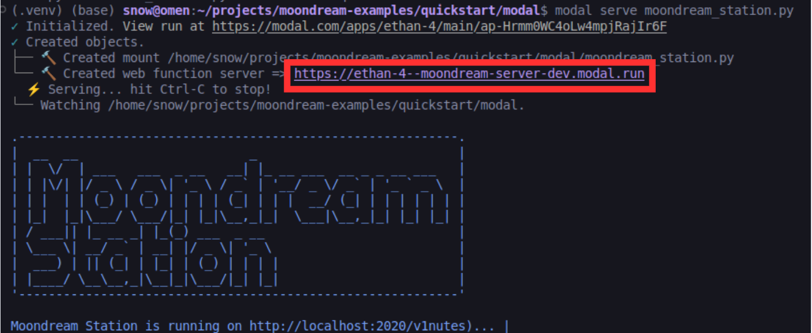

# Deploy Moondream Station on Modal Labs

Deploy Moondream vision AI as a web service with GPU acceleration.

## Setting Up

### **1. Create Modal account**
Go to [modal.com](https://modal.com) to sign up.

### **2. Install Modal Labs Python Library**:
To access Modal Labs deployment tools, you need to install the library:

   ```bash
   pip install modal
   ```

### **3. Login**
   To connect your computer to your modal labs account, run:
   ```bash
   modal token new
   ```
   This will open an authorization page in your web browser where you can authenticate your system with a login token.

### **4. Launching a Moondream Station Instance**

#### 1. Setup for Deployment

We can now create a program to host Moondream Station on Modal Labs, which will allow us to access Moondream from anywhere across the world. This is done by exposing the used by Moondream Station in the Modal Labs container using a webserver.

   ```python
# deploy_moondream.py
import modal
import subprocess

app = modal.App("moondream")

# this will create a container image on Modal Labs and install Moondream Station
image = modal.Image.from_registry("ubuntu:22.04", add_python="3.11").run_commands(
    [
        "apt-get update && apt-get install -y curl",
        "curl -fsSL https://depot.moondream.ai/station/install.sh | bash",
    ]
)

@app.function(
    image=image,
    memory=4096, # change your alloted memory here
    gpu="L4", # change your GPU here
    timeout=86400,
    # scaling parameters
    min_containers=1, # control the minimum containers which are warm at any time
    max_containers=1, # the max number of containers which your app can scale up to
    scaledown_window=300 # the max number of seconds containers remain idle before scaling down
)

@modal.web_server(2020, startup_timeout=300.0)
def server():
    subprocess.Popen(["/moondream_station"])

   ```
You can also check out this code [here](quickstart/modal/deploy_moondream.py).

#### **2. Deploying your Instance**:

To deploy, simply execute the following:
   ```bash
   modal deploy deploy_moondream.py
   ```
This launches Moondream Station on Modal Labs. 

To see the deployment logs in-terminal, use :

```
modal serve deploy_moondream.py
```

#### **3. Get your URL**
Modal will show your server URL at the start of execution. Make sure to copy this URL as you will need this to access the Moondream Station instance.



It may look something like:
   ```
   https://yourname--moondream-server-dev.modal.run
   ```
   or
   ```
   https://yourname--moondream-server.modal.run
   ```
   This is your permanent service endpoint.

#### **4. Stopping your Instance**:

To stop your instance, run:

```
modal app stop moondream
```

or if you ran it with `modal serve` you can exit by inputting `CTRL+C` on your keyboard.

You may also locate and stop the app from your Modal Labs dashboard.


## Inference

### Using Moondream Station CLI
To use moondream station from the Moondream Station CLI, launch Moondream Station locally and then set the inference URL to the endpoint. **Make sure to add `/v1` in front of the url that you copied.**

```
moondream> admin set-inference-url https://yourname--moondream-server-dev.modal.run/v1
```

Then continue to use moondream station normally:

```
moondream> query "What's in this image?" path/to/image.jpg
```

### Using Python Client
You can also access the modal labs endpoint using our Python client.

You will need to install the required libraries first:

```
pip install -r requirements.txt
```

Then, you can use the call the python client. Here's an example of what that may look like:

For example:
```python
# modal_infer.py
import moondream as md
from PIL import Image

# to use with the example code, make sure to add /v1 at the end
model = md.vl(endpoint="https://yourname--moondream-server-dev.modal.run/v1")
image = Image.open("/path/to/image")

# query
answer = model.query(image, "What's in this image?")["answer"]
print(answer)
```

You can check out this inference script [here](modal_infer.py).